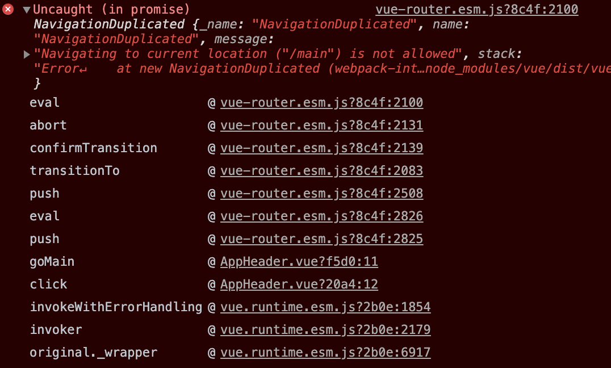
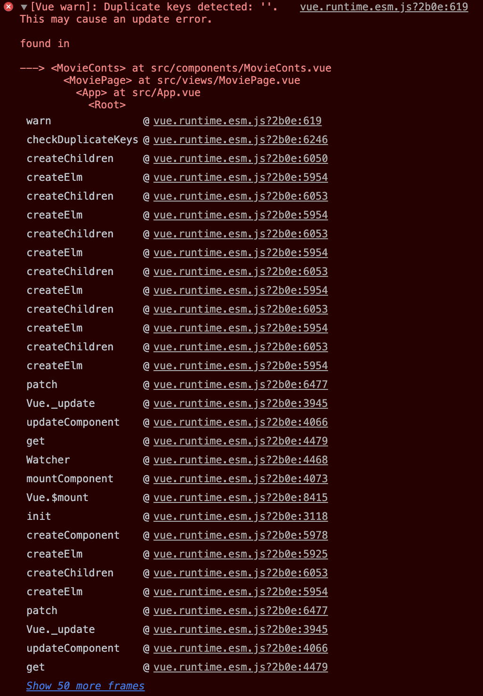

<h2>1. Movie App(vue.js) </h2>

- AppHeader의 버튼 클릭시 MainConts로 이동하도록 click하면 이동함수가 실행해서 router로 /main을 전달하도록 해주었다.
- 이렇게 하니 main페이지에 접속해 있을 때 header의 버튼을 클릭하면 에러가 발생함.


```
왜 이런 오류가 발생하는걸까
```
<br/>

===> 해결!
```javascript
if(this.$router.currentRoute.path !== '/main') { 
    this.$router.push('/main')
    .catch((error) => {
        console.log(error);          
    });
 }
```
- if문을 이용해서 현재 route가 어디인지 조건을 주니까 오류 없앨 수 있었다!
```javascript
// 처음에는 if문에서 현재 route판단을 name을 이용해서 줬더니 에러는 그대로 발생했다.(물론 catch를 줘서 에러로 뜨지는 않았다.)
this.$router.currentRoute.name !== 'main'
```
- <a href="https://stackoverflow.com/questions/58540009/got-uncaught-in-promise-navigationduplicated-error-on-invalid-credentials">이 페이지</a>의 질문답변을 참고했다.
<br/>

- 이제 남은 오류는 배우들 이름 출력 시 발생하는 오류..


<br/>


<h2>2. 프로그래머스 - 알고리즘 공부</h2>

- <h3><a href="">Lv1_15_</a></h3>
  
  - 
  - 6점.

     
<hr/>

- 내일 할 것.

- 스터디 다음주까지.
    - 강의 다 듣기.
    - 알고리즘 첫페이지 위에서 4개.
