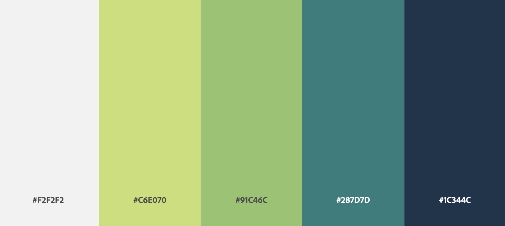
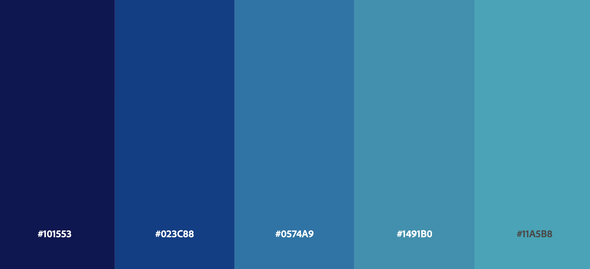
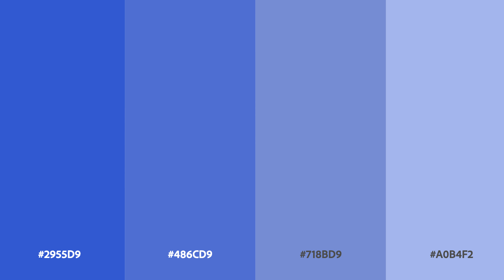
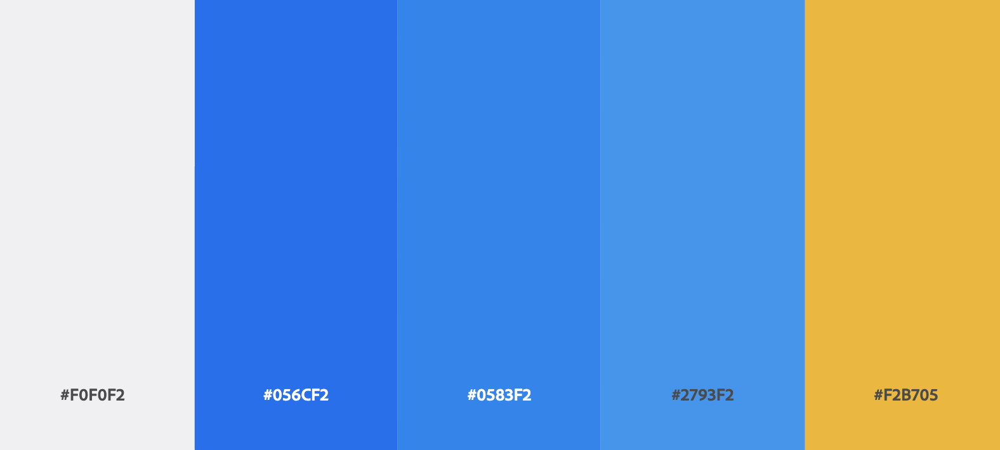
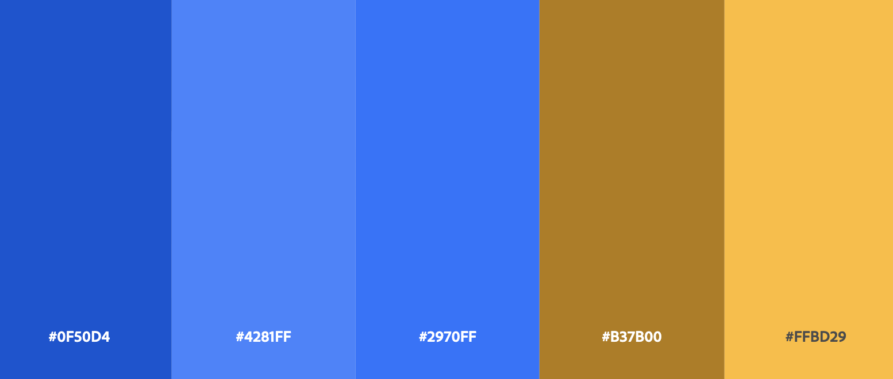

## 1. Git 공부

- Chapter7 - 4
- merge(3-way병합)과 rebase의 차이에 대해 배웠다.
  - merge는 충돌이 한 번만 발생하지만 커밋 히스토리가 지저분해진다.
  - rebase는 히스토리는 깔끔해지지만 충돌이 여러 번 발생할 수 있다.

 

## 2. 프로그래머스 알고리즘
- [Lv1_30_정수 내림차순으로 배치하기](https://github.com/EunJaePark/algorithm/blob/master/Lv1_30_%EC%A0%95%EC%88%98%20%EB%82%B4%EB%A6%BC%EC%B0%A8%EC%88%9C%EC%9C%BC%EB%A1%9C%20%EB%B0%B0%EC%B9%98%ED%95%98%EA%B8%B0.html)

 

## 3. 협업 프로젝트 - 가계부
- 디자인 
  - 지출 내역이 한눈에 잘 들어와야 하기 때문에, 메뉴박스를 상단이 아닌 좌측에 위치하는게 시각적으로 좋을 것 같다.
    - 상단에 메뉴 박스가 위치하면 답답한 느낌이 있을 것 같기 때문에...
    
  - 메뉴가 좌측에 위치한 디자인들 수집
    1. 맥북 앱스토어 - `Money Manager-지출관리, 편한가계부`
    2. [첫 번째 참고 디자인](https://docs.tink.com/resources/getting-started/set-up-your-account)
    3. [전체적인 디자인1](https://www.pinterest.co.kr/pin/745345807063126326/)
    4. [전체적인 디자인3](https://www.pinterest.co.kr/pin/54254370499390161/)
    5. [전체적인 디자인4](https://www.pinterest.co.kr/pin/54254370499858299/)
    
  - 로그인/회원가입
    1. [로그인/회원가입 참고1](https://www.pinterest.co.kr/pin/131519251603872503/)
    2. [로그인/회원가입 참고2](https://www.pinterest.co.kr/pin/846887904907495950/)
    
    
 - 컬러
    - 소비 관련 페이지니까 `blue or green`계열 컬러와 `white` 컬러가 중심이 되어 깔끔하 눈에 잘 들어오는 신뢰감 있는 색으로 구성하면 좋을 듯 싶다.
    
        
        
        
        
      
      
   ***
   **프로젝트 회의 내용(6.24)**
   - 메인컬러 : green
    - [이모티콘사이트](https://www.flaticon.com/)
    
     
    
    - 구조 짜기
      - router-view
        1. 로그인/회원가입 : [예시디자인](https://www.pinterest.co.kr/pin/294422894372433721/)
        2. 마이페이지 : 아이디, 닉네임, 패스워드, 한달 목표치
        3. 통계페이지 : 카드 형식으로 그래프들, 상세 지출 내역 정보 등을 카드 형식으로 분리해서 정리하면 좋을 듯.
        4. 데일리페이지: 위에서부터 1. 지출,소비내역 / 2. 지출액 입력칸 / 3. 일일소비내역표

      - 고정
        1. 네비(좌측)
        2. 퍼센테이지 바(헤더): 통계페이지와 데일리페이지에 둘 다 넣어주자.(헤더에 고정. views에서 별도 페이지를 생성해서)
        
      ***
    
    - 금요일 스터디까지
      - 목표금액 설정란을 어떻게 할지 생각해보기.
      - 마이페이지도 어떻게 더 추가하면 좋을지 생각.
      - 맥 윈도우 클론 에러 나는거 해결해보자.
  
  

  
  
  
  
