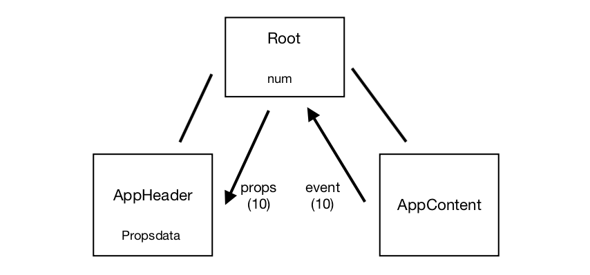
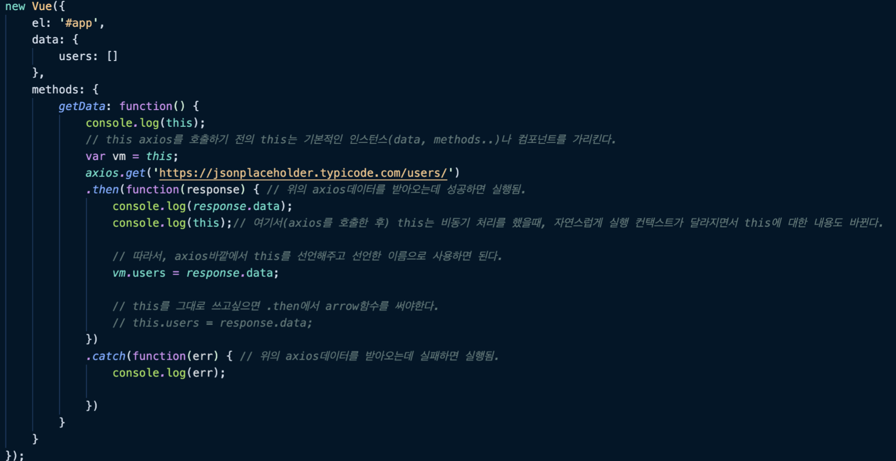
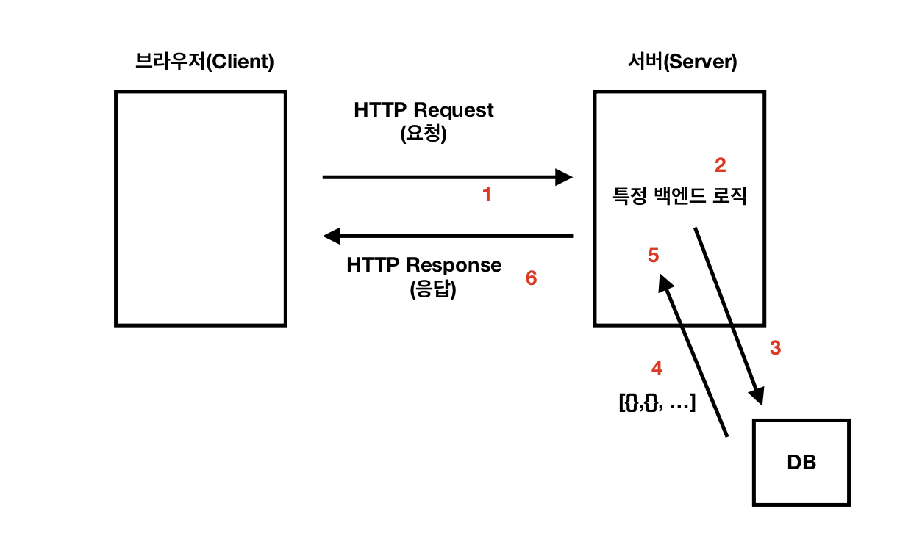

<h3>2020.05.09 ~ 2020.05.14 - 1</h3>

<h1>< Vue.js 시작하기 - Age of Vue.js >(인프런 강의)</h1>

 

<h2>1. 개발환경 설정</h2>

<h3> 5강 (뷰 개발자 도구 소개 및 실행 방법) </h3>

- Vue는 MVVM패턴의 뷰모델(ViewModel) 레이어에 해당하는 화면(View)단 라이브러리이다.
- 좌측의 View는 브라우저에서 사용자에게 비춰지는 부분이다. 입력버튼이라던지…
- 화면에 보이는 부분을 html이라고 하고, html은 DOM을 이용해서 자바스크립트로 조작을 할 수 있게끔 되어있다.
- 사용자가 View에서 마우스클릭, 키보드 입력했을 때, 그 이벤트들을 DOM Listeners로 vue에서 청취하게 됨. 이벤트들을 잡아서 자바스크립트에 있는 데이터를 바꿔주거나, 혹은 자바스크립트에 지정했던 특정 로직에서 실행하게 된다.

<h2>2. Vue.js소개</h2>

<h3> 6강 (MVVM 모델에서의 Vue) </h3>

- cmd + option + I : 개발자도구 단축키(맥)
- Ctrl + shift + i/F12 : 개발자도구 단축키(윈도우)
- ! + tab키 : html파일 작성시, 기본적인 구성 나오게함.
- div#app + enter키 : 태그를 쉽게 만들어줌.(이건 예를 든 태그네임)

<h3> 8강 (Reactivity 구현) </h3>

- vue의 핵심인 리액티비티(반응성). 
- 즉, 데이터의 변화를 감지해서 자동으로 화면에 뿌려주는 것.

<h2>3. 인스턴스</h2>

<h3> 11강 (인스턴스 소개) </h3>

- 인스턴스란 뷰로 개바할 때 필수로 생성해야 하는 코드이다.
- New Vue( );
- API는 쉽게 말해서 기능.
- New Vue( )의 인스턴스에는 엘리먼트 즉, el이라는 것을 꼭 작성해줘야 데이터를 사용할 수 있다.

  예) el :  ‘#app’.  이걸 인스턴스에 적고, <templete>의 해당 태그에도 적어줘야한다.(id면 id로..)

<h3> 12강 (인스턴스와 생성자 함수) </h3>

- 기본적으로 js에서 어떤 함수를 이용하여 인스턴스를 생성하는 함수는 ‘생성자 함수’이다.
- 함수의 이름이 대문자로 시작하면 암묵적으로 ‘생성자 함수’라는 것이다.
- MDN 생성자 함수 설명 문서 링크 : 
https://developer.mozilla.org/ko/docs/Web/JavaScript/Guide/Obsolete_Pages/Core_JavaScript_1.5_Guide/Creating_New_Objects/Using_a_Constructor_Function
- MDN Prototype 설명 문서 링크 :
https://developer.mozilla.org/ko/docs/Web/JavaScript/Reference/Global_Objects/Object/constructor

<h3> 13강 (3인스턴스 옵션 속성)  </h3>

- 생성자함수로 생성할 수 있는, 즉 재사용할 수 있는 옵션과 속성들에 대해 알아보자.
- New Vue({이 대괄호 속에 들은 것들});    :  el, template, data, methods, created, watch.
- 인스턴스를 생성하면 기본적으로 <Root>컴포넌트가 된다. (크롬의 개발자도구에서 vue를 보면 나옴)

 
<h2>4. 컴포넌트</h2>

<h3> 14강 (컴포넌트 소개) </h3>

- 뷰 컴포넌트 : 컴포넌트는 화면의 영역을 구분하여 개발할 수 있는 뷰의 기능이다. 컴포넌트 기반으로 화면을 개발하게 되면 재사용성이 올라가고 빠르게 화면을 제작할 수 있다.

<h3> 18강 (전역 컴포넌트와 지역 컴포넌트의 차이점) </h3>

- 지역 컴포넌트는 특정 컴포넌트 하단에 어떤게 등록되었는지 컴포넌트의 속성으로 바로 알 수 있다.
- 전역 컴포넌트(Vue.component( ))는 실무에서 구현할 때는 대부분 플러그인이나 라이브러리 형태로, 전역에서 사용해야하는 컴포넌트만 전역 컴포넌트로 사용한다.

<h3> 19강 (컴포넌트와 인스턴스와의 관계) </h3>

- 전역 컴포넌트는 vue인스턴스를 생성할 때마다 따로 생성하지 않아도 사용이 가능하다.
- 하지만 지역컴포넌트는 vue인스턴스를 새롭게 생성할 때마다 함께 생성해줘야 한다.

<h2>5. 컴포넌트 통신 방법 - 기본</h2>

<h3> 19강 (컴포넌트 통신) </h3>

- 컴포넌트는 기본적으로 고유한 데이터 유효 범위를 갖는다.
- 상위에서 하위로는 테이터를 내려준다.(props)
- 하위에서 상위로는 이벤트를 올려준다.(emit(이벤트발생))
- 부모의 데이터를 넘겨받을 때에는 v-bind:라는 데이터 바인딩기법을 사용. (데이터 바인딩이란 두 변수를 유기적으로 연결하여, 값이 변경되면 즉시 반영되는 것이라고 보면 된다.)
- v-on(이벤트).

<h3> 20강 (컴포넌트 통신 규칙이 필요한 이유) </h3>

- 특정 컴포넌트에서 변화가 생기면 유기적으로 나머지 컴포넌트에서도 데이터를 주고 받을 경우, 버그를 추적하는데 어렵다.(n방향 구조)
- 하지만 통신규칙이 생기면 데이터의 흐름을 추적하기 편해진다. 항상 데이터는 위에서 아래로 내려오고, 위로는 이벤트가 올라간다.

<h3> 21강 (props 속성) </h3>

- 카멜 케이스 : 두단어가 연결되었을 때, 두 번째 단어의 시작을 대문자로 시작하는 것. ex) appHeader 

<h3> 29강 (뷰 인스턴스에서의 this) </h3>

- this 정리해논 블로그 링크:
https://medium.com/better-programming/understanding-the-this-keyword-in-javascript-cb76d4c7c5e8
- w3에 나온 this에 대한 설명 링크.
https://www.w3schools.com/js/js_this.asp

<h2>6. 컴포넌트 통신 방법 - 응용</h2>

<h3> 32강 (같은 컴포넌트 레벨 간의 통신 방법 구현 2) </h3>

- component-same-level.html

===> 

	- Root에 있던 기존의 num값은 0으로 설정되어있음.
	- AppContent에 있는 버튼을 클릭시 Root로 num의 값에 10을 줌.($emit이용)
	- Root의 num에 10이 들어오고, 이 10이라는 num값을 AppHeader로 넘겨줌.(props이용)

===> 

	- Root가 가장 상위컴포넌트.
	- AppHeader와 AppContent는 형제관계.(같은 컴포넌트 레벨)

<h2>7. 라우터</h2>

<h3> 33강 (뷰 라우터 소개와 설치) </h3>

- 뷰 라우터는 뷰 라이브러리를 이용하여 싱글 페이지 애플리케이션을 구현할 때 사용하는 라이브러리이다.
- 라우터 공식 사이트 설치 문서 링크:
https://router.vuejs.org/installation.html

- router를 CDN방식으로 넣을 경우, vue src보다 아래에 적어줘야한다.

    	
		

<h3> 38강 (라우터 정리 및 학습 방향 안내) </h3>

- ‘네비게이션 가드’ 블로그 글 링크:
https://joshua1988.github.io/web-development/vuejs/vue-router-navigation-guards/

<h2>8. HTTP 통신 라이브러리 - axios</h2>

<h3> 39강 (HTTP 라이브러리와 Ajax 그리고 Vue Resource) </h3>

- axios(액시오스) : 뷰에서 권고하는 HTTP 통신 라이브러리.
- Ajax : 데이터 받아옴.(Asynchronous JavaScript and XML, 에이잭스). 비동기적인 웹 애플리케이션의 제작을 위한 웹 개발 기법이다.
- Ajax 위키백과 링크:
https://ko.wikipedia.org/wiki/Ajax

- Vue Resource 깃헙 주소:
https://github.com/pagekit/vue-resource

<h3> 40강 (axios 소개 및 오픈 소스를 사용하기 전에 알아야 할 것들) </h3>

- Axios 깃헙 주소 :
https://github.com/axios/axios

- 자바스크립트 비동기 처리와 콜백 함수 정리 링크:
https://joshua1988.github.io/web-development/javascript/javascript-asynchronous-operation/

- 자바스크립트 Promise 이해하기 :
https://joshua1988.github.io/web-development/javascript/promise-for-beginners/

- 자바스크립트 async와 await :
https://joshua1988.github.io/web-development/javascript/js-async-await/

- 자바스크립트의 비동기 처리 패턴 (위의 링크 보기)

		1) callback
		2) promise
		3) promise + generator
		4) async & await

<h3> 41강 (axios 실습 및 this 설명) </h3>

- jsonplaceholder 사이트 링크 :
https://jsonplaceholder.typicode.com/

- 자바스크립트 동작 원리 :
https://joshua1988.github.io/web-development/translation/javascript/how-js-works-inside-engine/

<h3> 42강 (웹 서비스에서의 클라이언트와 서버와의 HTTP 통신 구조) </h3>

- 개발자모드에서 network보는 방법. 
- HTTP란 클라이언트와 서버 간의 데이터를 주고 받기 위한 약속.

<h3> 43강 (크롬 개발자 도구 네트워크 패널 보는 방법) </h3>

- 개발자모드의 Network패널.
- 실제로 프론트엔드 개발할 때 가장 많이 보는 화면. 잘 사용하면 버그 잡는데 도움이 많이 될것이다.
- Network - Headers : HTTP의 헤더를 의미. 일반적인 정보들을 담는(특정 요청에 대한 정보, 응답에 대한 부가적인 정보 등…) 곳.
- Network - Headers - General - Request URL :  이 url로 get 요청을 보냈다고 이해할 수 있음.
- Network - Headers - General - Request URL - Request Method : GET.(위의 get). 이렇게 get으로 요청을 한 경우에는 Network - Response에 데이터가 항상 불러와진다.
- Network - Headers - General - Request URL - Status Code : 초록불은 정상이라는 의미. 200번대는 성공한 것을 의미.

- 프런트엔드 개발자가 알아야 하는 HTTP 프로토콜 :
https://joshua1988.github.io/web-development/http-part1/

- 구글 크롬 개발자 도구 공식 문서 :
https://developers.google.com/web/tools/chrome-devtools/

<h2>9. 템플릿 문법 - 기본</h2>

<h3> 44강 (템플릿 문법 소개) </h3>

- 뷰의 템플릿 문법이란 뷰로 화면을 조작하는 방법.
- {{ }} 콧수염 괄호를 이용해서 데이터를 화면에 연결할 때 사용. 이것이 데이터 바인딩.
- ‘v-‘가 붙는 것을 ‘뷰 디렉티브’라고 한다. (v-if, v-bind 등…)

<h3> 47강 ([실습 풀이] 클래스 바인딩, v-if, v-show) </h3>

- v-if는 보이지 않게 되었을 때, DOM에서 그 존재 자체를 없애준다.
- v-show는 보이지 않게 되었을 때, 유관상으로만 화면에서 없어지고 DOM에 정보는 남아있다.

<h3> 48강 (모르는 문법이 나왔을 때 공식 문서를 보고 해결하는 방법) </h3>

- Form Input Binding 공식 문서:
https://vuejs.org/v2/guide/forms.html#ad

<h2>10. 템플릿 문법 - 실전</h2>

<h3> 50강 (watch 속성) </h3>

- watch: data를 대상으로 넣을 수 있고, data의 변화에 따라서 특정 로직을 실행하게 해줌.

<h3> 51강 (watch 속성 vs computed 속성) </h3>

- watch : computed와 비슷한 느낌. 무거운 로직들 즉, 매번 실행되기 부담스러운 로직들을 계산. 데이터 요청에 적합.  (그렇다면 날씨app에서 기본적인 날씨 데이터들 불러올 때 watch로 써야하는건가?? computed로 만들었었는데…..!)
- computed : 단순한 값에 대한 계산. 단순한 텍스트의 입력을 받아서 거기에 대한 벨리데이션 값을 계산.

- watch 속성과 computed 속성 차이점에 관한 공식 문서 링크 : 
https://vuejs.org/v2/guide/computed.html#ad

<h2>11. 프로젝트 생성 도구 - Vue CLI</h2>

<h3> 53강 (최신 Vue CLI 소개) </h3>

- CLI : Command Line Interface
- Node -v : 10점대 버전 이상이어야 함.
- Nom -v :  6점대 버전 이상이어야 함.

- vue/cli 설치 명령어

		npm install -g @vue/cli

- Vue CLI 공식 사이트 링크 : 
https://cli.vuejs.org/

<h3> 54강 (Vue CLI 도구 설치할 때 문제점 해결 방법) </h3>

- sudo : 사용자 권한이 없다는 에러가 나올 때 입력해주면 됨. 
- /user/local/lib/node_modules 에 설치가 된다.(mac기준)

- Where does npm install packages? 스택 오버 플로우 글 :
https://stackoverflow.com/questions/5926672/where-does-npm-install-packages

<h3> 55강 (VCLI 2.x와 3.x의 차이점 / 프로젝트 생성 및 서버 실행) </h3>

[Vue CLI 2.x]
- vue inintéressant ‘프로젝트 템플릿 유형’ ‘프로젝트 폴더 위치’
- vue inintéressant Webpack-simple ‘프로젝트 폴더 위치’

[Vue CLI 3.x]
- vue create ‘프로젝트 폴더 위치’

- 웹 개발할 때 알아두면 좋은 리눅스 명령어 글 :
https://joshua1988.github.io/web-development/linux-commands-for-beginners/

<h3> 56강 (CLI로 생성한 프로젝트 폴더 구조 확인 및 main.js 파일 설명) </h3>

- npm, webpack 부분을 따로 살펴보면 좋음.

- npm run serve라는 명령어는 vue-cli-service serve를 더 짧고 편하게 적은 것.

- public 폴더의 index.htm파일에 적힌 

		built files will be auto injected 
	는  빌드된 파일들이 자동으로 연결될 것이라는 의미이다.
- 즉, index.html로 src폴더 속의 모든 파일들이 연결되는 것.( 최소한의 파일로 변환하여 연결됨)

<h3> 57강 (싱글 파일 컴포넌트 소개 및 여태까지 배운 내용 적용하는 방법) </h3>

- components의 .vue파일 생성시, 싱글파일 컴포넌트 코드 단축키 : def + enter키.

<h2>12. 싱글 파일 컴포넌트</h2>

<h3> 59강 (싱글 파일 컴포넌트에 배운 내용 적용하여 개발 시작하기) </h3>

	<template>에는 하나의 엘리먼트만 있어야한다.(하나의 태그로 나머지 태그들이 감싸져 있어야함.)

<h3> 60강 (싱글 파일 컴포넌트 체계에서 컴포넌트 등록하기) </h3>

- components의 파일들을 추가할 때에는 파스칼 형식(단어단어마다 시작을 대문자로 작성)으로 작성해야함. 예) AppHeader.vue
- 또한, 최소한 두 단어 이상으로 지어줘야한다. 
- 예를 들어, main이라는 컴포넌트를 만들었을 때, App.uve에서 <main></main>이라고 치면 기존의 main.js파일인지, 컴포넌트인 main.vue파일인지 알 수 없기 때문에 두 단어 이상으로 작성하는 것을 권고한다.

- import AppHeader from ‘./components/AppHeader.vue'

    : import로 파일을 들고올 때, 파일경로를 마지막에 파일확장자명까지 적어줘야 연결이 잘 된다.

<h3> 63강 (Vue CLI로 생성한 프로젝트 내용 정리) </h3>

- vue-cli는 커맨드라인 인터페이스(CLI)라는 명령어 실행 보조 도구로 생성한 프로젝트를 의미한다.
- 생성 후 가장 먼저 살펴볼 부분은 public의 index.html에 있는 주석한줄이다.(모든 컴퍼넌트가 하나의 파일로 된다는 내용) -> webpack에 대해 알아보세요.

- 웹팩 NPM 소개 강좌 링크 :
https://www.inflearn.com/course/webpack-%EC%9B%B9%ED%8C%A9-%EA%B0%95%EC%A2%8C/lecture/8151

<h2>13. 최종 프로젝트 - 사용자 입력 폼 만들기</h2>

<h3> 64강 (프로젝트 생성 및 마크업 작업) </h3>

- 터미널에서 ctrl + c를 누르면 기존에 열어놓은 서버를 종료할 수 있다. 기본적으로 실행되는 서버가 webpack데브 서버라고 하는 간단한 노드 서버이기 때문에 ctrl + c로 os에 상관없이 종료할 수 있다.

<h3> 65강 (v-model 속성과 submit 이벤트 처리) </h3>

- 이벤트 버블링과 캡쳐링 블로그 글 :
https://joshua1988.github.io/web-development/javascript/event-propagation-delegation/

- 💡 참고
	- CLI 버전이 업데이트되면서 기본적으로 ESLint 오류가 나면 화면을 조작할 수 없게 되었습니다. ESLint 에러를 화면에 표시하지 않으려면 아래와 같이 설정해주세요.
	 1. 프로젝트 폴더에 `vue.config.js` 파일 생성
	 2. `vue.config.js` 파일에 아래 내용 입력
	 
			 module.exports = {
				devServer: {
					overlay: false
				}
			   }
	 3. 파일 저장
	 4. `Ctrl + C`로 서버 종료 후 `npm run serve`로 다시 실행
	 5. 결과 확인

<h3> 66강 (axios를 이용한 데이터 전송 및 form 구현) </h3>

- npm i axios  : 특정 라이브러리 즉 우리가 설치한 라이브러리를 사용할 수 있게끔 현재 프로젝트에 다운받는 것을 의미한다. (npm i axios의 i는 install)

- 최종 프로젝트의 vue-form의 App.vue의 전체적인 코드모습.

<h2>14. 마무리</h2>

<h3> 67강 (수업 정리 및 향후 학습 방향 안내) </h3>

- <b>Reactivity</b> : vue.js가 추구하는 중심 사상이자 핵심 기능이다. 웹개발에 대한 동작들을 라이브러리에서 좀더 편하게 관리해 준다는 것이 reactivity의 핵심.
- <b>인스턴스</b> : vue로 개발을 할 때 필수로 생성해야하는 단위이자, 실제로 인스턴스 안에 어떤 내용들을 추가함으로써 화면을 조작할 수 있다.
- <b>컴포넌트</b> : 화면을 영역을 구분해서 개발할 수 있음. 컴포넌트 개발이 프론트엔드 프레임워크에서 가장 중요한 개발이다. 재사용성 즉, 코드의 반복을 줄이는 것이 핵심.
- <b>컴포넌트 통신</b> :  컴포넌트로 개발할 때 데이터의 흐름을 제어하기 위한, 즉, 데이터의 규칙들을 제한하면서 개발할 수 있다. 제한을 하면서 생기는 이점들은 여러명이 협업해도 데이터의 흐름을 예측할 수 있는 것.
 	- <b>props</b> : 상위에서 하위로 데이터이동.
	- <b>event emit</b> : 하위에서 상위로 데이터 이동.
- <b>HTTP 통신 라이브러리 (axios)</b> : axios 깃헙 레퍼지토리에서 더 자세하게 살펴보면 좋습니다.
- <b>템플릿 문법</b> : 화면을 조작하기 위한 vue의 문법들.
	- <b>데이터 바인딩</b> : Reactivity와 비슷한 개념. 데이터의 변화에 따라서 화면에 반영해주고 실제로 그 데이터를 화면에 엮어내는 것.
	- <b>뷰 디렉티브</b> : 화면을 조작하기 위해서 vue가 추가적으로 제공하는 문법. (v-) ex) v-bind, v-on….
- <b>Vue CL</b>I : 프로젝트를 생성할 때 명령어를 이용해서 생성하는 방식.
- <b>싱글 파일 컴포넌트</b> : Vue CLI 아래에서 생성되는 .vue파일. webpack의 기능에 대해 더 공부하면 좋습니다.

  

- vue 홈페이지의 공식 문서들을 한번 정독해보세요. (공식문서는 우측상단의 Learn - Guide를 지칭하는 것)
- 한국어보다는 원문을 보는 것을 추천. 한국어로 보면 원문의 내용을 훼손할 위험이 있기도 하고, 공식문서가 거의 매일 업데이트 되는데 한국어로 번역되는데 시간차가 있기 때문이다.
- Style Guide도 정독해보는 것을 추천.(얘는 한글도 괜찮음)
- Cookbook도 읽어보세요. 실제로 구현하면서 부딛힐 수 있는 문제들에 대해 알 수 있음.

  

- Vue.js 공식 문서 :
https://vuejs.org/v2/guide/

- Vue.js 스타일 가이드 :
https://vuejs.org/v2/style-guide/

- Vue.js Cookbook :
https://vuejs.org/v2/cookbook/

- Vuex 공식 문서 :
https://vuex.vuejs.org/

- VueRouter 공식 문서 : 
https://router.vuejs.org/

- Vue CLI 공식 문서 :
https://cli.vuejs.org/
