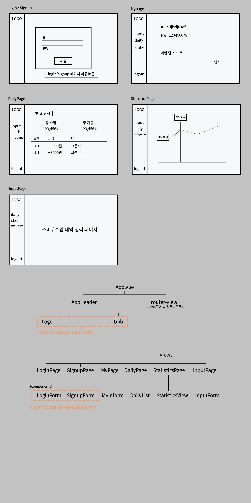

## 1. Git 공부

- chapter6.

- CLI 방식으로 하는 push, commit, pull, 저장소 연결 등을 배웠다.

- git의 기본 에디터를 Visual Studio Code로 바꿔줬다.
  - 책에 적힌대로 하니 잘 안되서, 다른 사람이 작성해 놓은 글 보고 참고했다.
  - [이 블로그 참고 함](https://medium.com/@hohpark/vs-code%EB%A5%BC-git-diff-tool%EB%A1%9C-%EC%84%A4%EC%A0%95%ED%95%98%EA%B8%B0-88baa1d9f2b3)

- 지난 번 GUI방식으로 공부할 때 바꿔놓았던 keychain때문에 push하는데 헤맸다. 
  - GitHub 두 번째 계정으로 수정했던 keychain을 다시 기존 원래의 계정으로 되돌려 놓으니 문제없이 push가 되었다.

- 공부 내용 정리를 StackEdit을 이용해 작성 후, 깃헙에 올려보았다.
  - 작성은 mark down 문법으로 했는데, 깃헙에 publish되는 건 html문법으로 된다.
  - publish될 때 선택을 바꿔보아도 전부 html문법으로 올라가져서 결국 내용을 붙여넣어 수정함.

## 2. 프로젝트 - 가계부
- 구조 설계.
- 지난번 스터디에서 짠 폴더에서 조금 변형시켰다.

