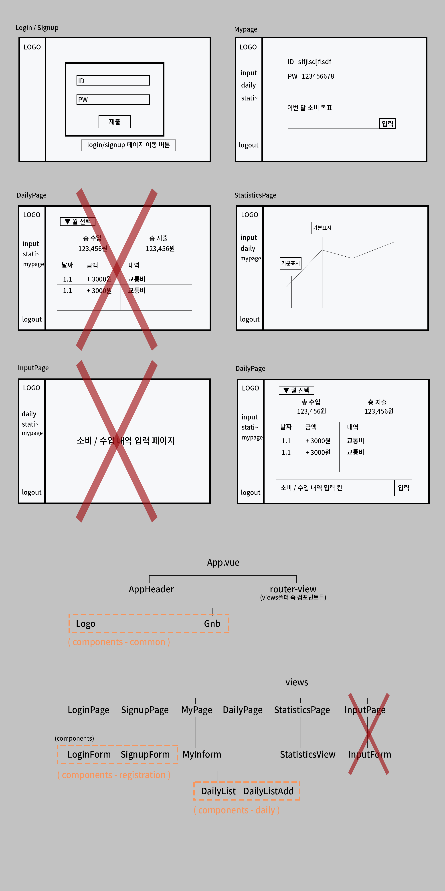

## 1. Git 공부
- Chapter7 - 1,2,3 공부.
- CLI 방식으로 checkout, 병합(merge), 재배치(rebase), 태그 생성, 충돌 발생 시 3-way병합하기를 배웠다.
- 책 보면서 따라하고, 정리하면서 공부하고 있기 하지만 머리에 잘 들어오지 않는다.
- 1회독 하고 난 후 다시 보고, 협업 프로젝트 진행 때도 다시 공부해야겠다.
  
<br/>

## 2. 프로그래머스 알고리즘
- ### [Lv1_28_정수 제곱근 판별](https://github.com/EunJaePark/algorithm/blob/master/Lv1_28_%EC%A0%95%EC%88%98%20%EC%A0%9C%EA%B3%B1%EA%B7%BC%20%ED%8C%90%EB%B3%84.html)
  - 3점. 
  - 이전 알고리즘 문제를 풀며 공부한 parseInt()의 속성을 이용해 풀었다.
    - [Lv1_20_하샤드 수](https://github.com/EunJaePark/TIL/blob/master/2020%EB%85%84%206%EC%9B%94/200609.md)에서 나왔었다.
  - 제곱 관련 함수를 검색하니 Math.sqrt(), Math.pow()함수가 바로 나와 쉽게 풀 수 있었지만, 너무 큰 힌트를 본 느낌이다.
  - 그래서 Math함수를 사용하지 않고, while문과 if문, 삼항연산자를 이용해 다시 풀어보았다.
  <br/> 

  ```
  - Math.sqrt() : 인자의 제곱근을 구하는 함수.
  - Math.pow(a, b) : a를 b번만큼 제곱한 값을 구해주는 함수.
  - Number.isInteger() : 인자가 정수인지 판별하는 함수. 정수이면 true, 아니면 false 산출.
  ```

- ### [Lv1_29_자연수 뒤집어 배열로 만들기](https://github.com/EunJaePark/algorithm/blob/master/Lv1_29_%EC%9E%90%EC%97%B0%EC%88%98%20%EB%92%A4%EC%A7%91%EC%96%B4%20%EB%B0%B0%EC%97%B4%EB%A1%9C%20%EB%A7%8C%EB%93%A4%EA%B8%B0.html)
  - 4점. 
  - 지금까지 배운 여러 함수들 사용해서 풀 수 있는 문제였다.
  - 오랜만에 검색하지 않고 푼 문제!!!
  - map()함수를 이후 알고리즘 문제에서 사용해 보도록 하자.
    - 아직 map()함수를 사용할 때 버벅인다.
  - 수학 공부를 해야겠다고 다시 한 번 느꼈다...

<br/>

## 3. 협업 프로젝트 - 가계부
- 컴포넌트 구조 변경함
  - 일일 소비내역 보는 페이지와 지출액 입력 페이지 합침.
  
  

  
  
  
