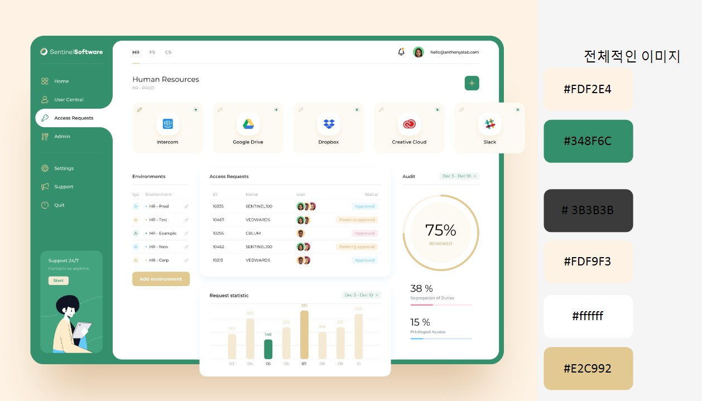

## 1. 협업 프로젝트 - 가계부
### 오늘 회의 내용
- 통계페이지
	- 그래프별 컴포넌트 따로 생성하면 좋을 듯.(총 3개-원그래프, 막대그래프, 상세내역)
	- setting페이지에서 은행별 목표금액을 은행별 내 자산 입력으로 바꾸자.
		- 목표금액은 총 금액만 입력. 자산을 현금/카드로 나눠서 입력.

***
- Daily : 수입,지출은 그날의 총액만.

- Main : 메인이면 상태바가 보이니까 목표금액(ex) 40만원)이 고정되어 보이도록.
				해당 달 현재까지 쓴 금액 보이도록.
				리스트 추가하고 싶을 때를 위한 Daily페이지로 연결 버튼.
				
- Mypage : setting페이지로 연결될 버튼 필요.

- Rgistration : 회원가입 / 로그인 했을 때 기본 세팅값이 없을 경우 setting페이지로 이동하고, 세팅값이 cookie에 저장되어있으면 main페이지로 이동하게.(카카오로그인api사용해보고 다시 결정하도록)

- 셋팅, 마이페이지 - 나
- 로그인, 사이드바 - 명주씨
- 데일리, 로딩바 - 진아씨
- 통계, 메인페이지 - 가영씨

***
- 공통 css
	```
  html {font-size:100%}
  body {
    font-size:12px;
    font-family: 'Noto Sans','Noto Sans KR', sans-serif;
    line-height:1.6;
    margin:0;
    padding:0;
    word-break: keep-all;
  }
  h1, h2, h3, h4, h5, h6 {font-size:1em;}
  h1, h2, h3, h4, h5, h6, div, p, dl, dt, dd, ul, ol, li, form, fieldset, blockquote, address, table, thead, tbody, tfoot, tr, td, caption {
    margin:0;
    padding:0;
  }
  ul, ol, li {list-style:none;}
  a:link, a:visited {color: #666666;text-decoration:none;}
  strong, span, p {color: #1e1e1e; }
  ```
***

- color 




<br/>

- 회의내용 요약
	```
	✨ 중간회의(6/30)
	
	1. DailyPage _ ★★★★☆ 진아
	   - 수입지출 기록(오늘 한것만 값을 불러옴)
	   - 쿠키 저장/스토어 에서 불러옴.
	   - 데이터를 통계페이지로 보내야함
	   - 세팅페이지의 카테고리 항목에서 설정한 카테고리 가져와야함
	   
	2. MainPage _★★★☆☆ 가영
	   - 전체 목표금액
	   - 각 항목들 자산 내역(ex. 현금:30만원…)
	   - 세팅페이지에서 설정한 데이터를 불러와야함
	   - 설정해놓은 데이터 값이 있을경우에만 해당 페이지가 보여진다.
	   - 위에 상태 보이기때문에 목표금액은 고정, 다른 자산들은 계속해서 변경
	   - 데일리 페이지로 연동 되는 버튼
	
	3. MyPage _ ★☆☆☆☆ 은재
	   - 아이디와 이름 정보만 있음
	   - 회원가입 페이지에서 정보를 가져옴
	   - 잘못 입력 했을수도 있으므로 setting 페이지로 이동한다.
	
	4. RegistrationPage _★★★★☆ 명주
	   - 로그인
	   - 회원가입(이름,아디이 마이페이지로 보내야함)
	   - css (복잡할것으로 예상)
	   - 로그인 했을 경우 목표금액 설정하는 페이지(세팅페이지) 자동으로 나옴(목표금액을 설정했을때는 안나오게 해야함)
	   - 컴포넌트 각각 정해서 폴더에 넣기
	
	5. SettingPage _ ★★★★☆ 은재
	   - 각 항목들의 목표 금액을 설정하는 페이지
	   - 수입/지출 카테고리를 추가할수 있는 페이지
	   - 데일리 페이지에 설정한 카테고리 항목데이터를 보내야함
	
	6. Sidebar _ ★☆☆☆☆ 명주
	   - 각 페이지를 라우터로 연결하는 페이지
	
	7. StatisticsPage ★★★★☆ 가영
	   - 각항목별, 월별 통계 페이지
	   - 데일리 페이지의 데이터를 가져와야함
	   - css 로 통계그래프 만들어야함.
	   - 컴포넌트 각자 만들어서 관리(유지보수성을위해)
	
	8. StatusHeadPage ★★★☆☆ 진아
	   - 목표금액 상황을 보여주는 수치를 보여주는 페이지
	   - 데일리 페이지에서 데이터 가져옴(목표금액)
	
	9. MonthPage(보류)
	```
