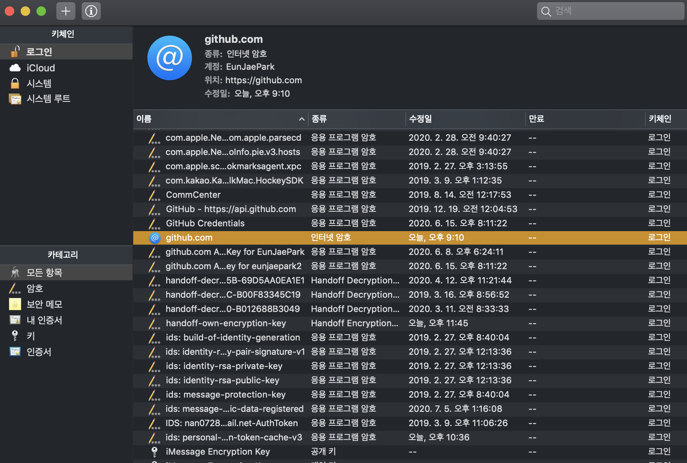
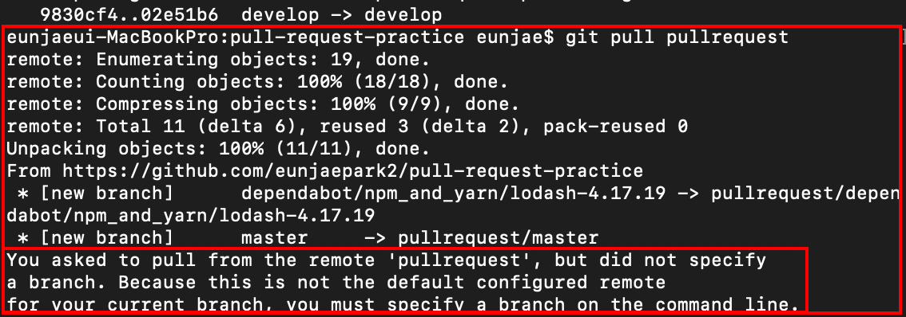

## 1. 협업 프로젝트

### pull request 연습

-  #### [해당 블로그 참고해서 연습 함](https://wayhome25.github.io/git/2017/07/08/git-first-pull-request-story/)
    
    ```
    1. Fork
        
        타겟 프로젝트의 저장소를 자신의 저장소로 fork한다.
    
    
    2. clone 생성
    
        1) fork로 생성한 본인 계정의 저장소에서 [clone or download]버튼을 눌러 url을 복사한다.
        
        2) 터미널을 켜 저장소를 생성하려는 폴더로 이동 후 clone한다.       
            ( $ git clone https://github.com/eunjaepark/pull-request-practice.git )
        
        
     3. remote 생성
     
        1) 원본 프로젝트 저장소를 원격 저장소로 추가           
            ( $ git remote add develop https://github.com/eunjaepark2(원본계정)/pull-request-practice.git )
            *** develop라고 적어준 것이 remote이름이다. 
                일반적으로는 upstream이라고 많이 사용한다.

        2) 원격 저장소 설정 현황 확인방법     
            ( $ git remote -v )
           
           
     4. branch 생성
     
        1) 자신의 로컬 컴퓨터에서 코드를 추가하는 작업은 branch를 만들어서 진행해야 한다.
        
        2) develop 이라는 이름의 branch를 생성한다.
            ( $ git checkout -b develop )
            Switched to a new branch 'develop'

        3) 이제 2개의 브랜치가 존재한다.
            ( $ git branch )
            * develop
              master
              
              
     5. 수정 작업 후 add, commit, push
     
        1) vscode를 이용해 코드를 수정해준다.
        
        2) 수정작업이 완료되면 add, commit, push를 이용해 자신의 GitHup repository(origin)에 수정사항을 반영한다.
            ( $ git add . )
            ( $ git commit -m '커밋메세지작성' )
            ( $ git push origin develop )
            *** push 진행시에 branch 이름을 명시해주어야 한다.
                실습에서는 develop 브랜치의 수정 내역을 origin 으로 푸시해준다.
                
                
     6. Pull Request 
     
        1) push 후 본인 계정의 GitHub 저장소에 돌아오면 [Compare & pull request]버튼이 활성화 되어 있을 것이다.
        
        2) 해당 버튼을 선택해 메세지를 작성하고 pull request를 생성한다.
        
        
     7. 코드리뷰, Merge Pull Request
     
        1) 원본저장소로 sign in 한 뒤, 요청들어온 pull reqeust를 확인하고 Merge 여부를 결정해 준다.
        
            - 이 때, 충돌하는 코드가 발생해 수정 후 병합해줬다.    
              (다행히 스터디 때처럼 덮어씌워지지 않고 충돌이 발생했다!!)
              
              
     8. Merge 이후 동기화 & branch 삭제
     
        1) 원본 저장소에 Merge가 완료되면 로컬저장소의 코드와 원본저장소의 코드를 동기화 해준다.
            ( $ git pull develop )
            
        2) 작업하던 로컬저장소의 branch를 삭제한다.
            ( $ git branch -d develop(브랜치 이름) )
    ```
    
    - GitHub 계정에 따라 컴퓨터 자체의 keychain을 현재 작업중인 GitHub계정에 맞게 변경해줘야 한다. 
        - `command` + `space bar`를 눌러 `Keychain Access.app`를 검색한 뒤,     
           아래 이미지처럼 `github.com`을 클릭 해 GitHub계정을 바꿔준다.
            
            [해당 블로그 참고](https://recoveryman.tistory.com/392)
        <br/> <br/>
        
    - ~~새로운 계정에 새로운 레퍼지토리 생성하고 파일들 커밋해줌 (터미널 사용)~~   
      ~~[이 블로그 참고](https://victorydntmd.tistory.com/53)~~
      - 내가 클론하려는 공간으로 `$ cd`한 뒤에 클론해주면 된다. 
       <br/> <br/>

    - `pull` 시도 했을 때 발생한 오류 해결 [블로그 참고](http://spectrumdig.blogspot.com/2013/01/git-fork.html)
      
       <br/> <br/>

    - `git pull remote이름`
      - fork한 원본저장소와 브랜치 속 내용까지 똑같이 바뀌는게 아닌, fork한 원격저장소의 해당 브랜치로 내용이 동기화 되는 듯.
    
 ***
 
 - `remote`   
 
    [remote 관련 내용 블로그 참고](https://webclub.tistory.com/322)
    
 -  `upstream`
 
    - 처음으로 fork를 시도한 저장소(다른 사람의 GitHub 저장소)를 upstram이라고 한다.
    - `clone`을 시도하면 `origin`이라는 remote저장소가 자동으로 생성된다.    
    - `origin`과 구분하기 위해서 `upstream`이라는 명칭을 주로 사용한다.
    - 즉, `remote`저장소라고 볼 수 있겠다.
