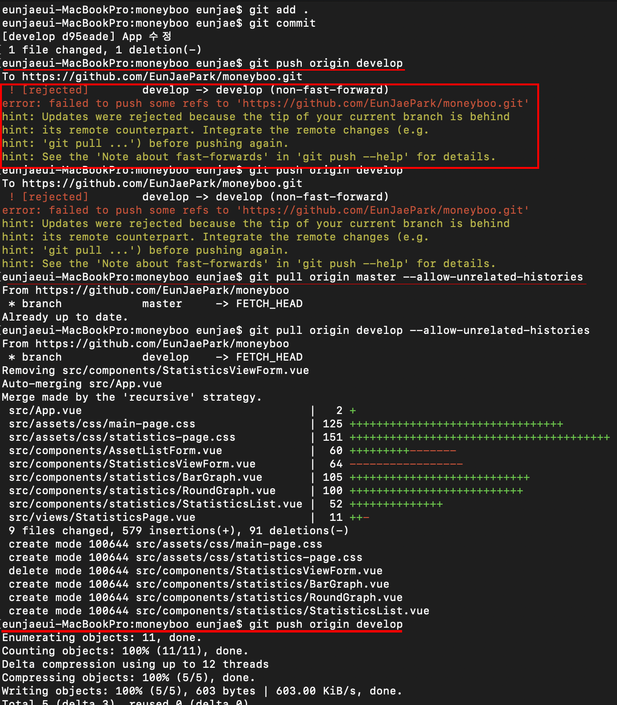

## 1. 협업 프로젝트 - 가계부
- [머니부 프로젝트](https://github.com/EunJaePark/moneyboo)

- 'css작업한 것 + 코드(미완성)' pull request 성공!!
  - 어제 연습한대로 했더니 이번에는 충돌도 발생하고 잘 진행되었다.
  - 원격저장소에서 원본저장소와 동기화하기 위한 pull에서 약간의 버벅임이 있긴 했지만 어쨌든 성공함.
  
- 오늘 진행한 `pull request` 진행 과정
  ```
  1. 협업자들이 원격저장소에서 upstream 생성.
      ( $ git pull upstream )
  
  2. 생성한 upstream에서 'feature/본인이름' 브랜치 생성.
    - 기존 원본저장소에서는 master, develop 이렇게 두 개의 브랜치를 생성해 놨었음.
    - 협업자들은 develop브랜치에서 'feature/본인이름'브랜치를 생성.(일회용)
    
  3. 'feature/본인이름'브랜치에 커밋한 후 원본저장소로 pull request 요청.
  
  4. 원본저장소에서 pull request를 확인 후 conflict가 있을 경우 요청한 사람에게 충돌 해결해달라는 메세지 보냄.
  
  5. 요청자가 충돌 해결 후 다시 pull request 진행.
  
  6. 원본저장소에서 충돌이 없는 요청의 병합 진행.
  
  7. 원본저장소 주인이 병합한 저장소 내용을 pull로 내려받아 확인 후, 다시 push.
      - 이때 push명령어를 입력 후 에러가 발생했었다. 
      - 바로 아래의 이미지와 같이 에러가 발생함.
  
  8. 원격저장소를 가진 협업자들이 pull upstream을 통해 각자의 원격저장소를 원본저장소의 내용과 동기화 함.
      ( $ git pull upstream develop )
  
  9. 일회용으로 생성한 'feature/본인이름' 브랜치 삭제함.
  ```
  
- 아래 이미지와 같이 `git push`실행 시 발생한 에러 해결.     
      
   
  - 원인 
    - 깃허브에 생성된 원격 저장소와 로컬에 생성된 저장소 간 공통분모가 없는 상태에서 병합하려는 시도로 인해 발생. 
    - 기본적으로 관련 없는 두 저장소를 병합하는 것은 안되도록 설정되어 있음.
  - 해결
    - 아래와 같이 git pull 시에 –allow-unrelated-histories 옵션 추가하여 관련 없었던 두 저장소를 병합하도록 허용
      ```
      git pull origin master --allow-unrelated-histories
      ``` 
    [해당 블로그 참고](https://devlog.jwgo.kr/2018/03/09/resolving-git-pull-problem/)
  <br/>
  
- `fetch`와 `pull`의 차이
  - `pull`
    - 원격저장소로부터 필요한 파일을 다운 + 병합
    - 지역브랜치와 원격저장소의 origin/master가 같은 위치를 가리킨다.
  - `fetch`
    - 원격저장소로부터 필요한 파일을 다운 (병합은 별도로 해줘야 함)
    - 지역브랜치는 원래 가지고 있던 지역저장소의 최근 커밋 위치를 가리키고, 원격저장소의 origin/master는 가져온 최신 커밋을 가리킨다.
 [해당 블로그 참고](https://yuja-kong.tistory.com/60)

<br/>

- `<button>` css 기본 스타일 정함.
