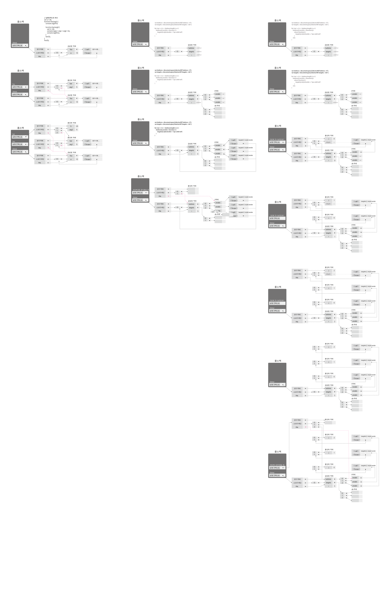

##### 🗓 2020. 10. 19(월)

- [수업판서 노션](https://www.notion.so/FE-055dfe8ec00349aabc6a55a0b45d1eb2)

### # 개요
- 1)'객체로 정보 생성', 2)'정보를 읽어 자바스크립트 엔진이 스택을 쌓으며 처리하는 것'으로 분류해 강의할 예정.
  
- `html`은 언어자체가 `유니버셜`이다. 모두에게 화면에 표시해서 정보를 제공할 수 있게끔 함.
- 정보뭉치를 표현해 내기 위해 `tag`를 생성하는 것.
- `DOM` / `CSSOM`
	- `DOM`의 `className`이라는 항목이 있는데, 클래스 네임을 주기 위해서는 `class="클래스명"`이라고 tag에 적어주면 된다.
	- `속성` 이란 하나의 항목 속의 속성(프로퍼티)이다.
	- `node.js`를 이용해 파일을 만들어놓은 것을 연결하고, import/export를 하며 작업할 수 있도록 하는 것이다. 이를 통해 앵귤러, 리액트 등의 개발 프레임워크가 나올 수 있는 것이다.
	- 프레임워크는 가이드(틀)을 제공하고, 라이브러리는 
	- 프레임워크에는 리액트, 라이브러리에는 제이쿼리 등이 속한다.

### # 실행컨텍스트
- 어떤 순서로 스크립트엔진이 실행되는지 알아보자.
- `렌더링엔진`과 `자바스크립트엔진`이 서로 상효작용하며 일어난다.
- 렌더링엔진 진행순서
	- Parsing → DOM → CSSOM → Render tree → Layout → Paint
- 자바스크립트엔진
	- `call stack. 콜스택`
		- 콜스택은 배열이라고 생각하면 된다.
		- `stack.스택` : 코드를 처리하는데 필요한 묶음(콜스택)들이 아래부터 순서대로 하나하나씩 쌓인 것.
	- 어떤 메모리 주소에 데이터를 적용해서 화면을 뿌리는데 이용한다. (비트맵은 깨짐. 백터가 대세)
	```javascript
	// 편의상 그림그릴 수 없기에 var로 선언해 순서대로 적어줌.
	var callStack = {
		2: 2번 컨텍스트
		1: 1번 컨텍스트
		0: 글로벌 컨텍스트
	}
	```
	- 글로벌 컨텍스트 
		- 전체 프로그래밍에 필요한 준비물이 들어있는 베이스 컨텍스트.
		-  ex)    
			- `alert()`함수를 실행했을 때, alert을 호출하는 걸 글로벌 컨텍스트가 하는 것이다.
    ```javascript
    alert('hello');				
    ```
	- 클로벌 컨택스트는 `0:this`, `1:스코프체인`, `2:변수객체`로 이뤄져있다.
    ```javascript
    var GlobalContact = {
      VO: window(GO),
      Scope: afdf,
      this: adfs
    }
    var window = {
      alert: function() {},
      atob: function() {},
      document: function querySelector() {}
    }				
    ```
	- `window.document.querySelector()`이렇게 순서이지만 `window`는 기본적으로 항상 붙어있기 때문에 주로`document.querySelector()`로 사용한다.
	```javascript
	var callStack = {
		2: 2번 컨텍스트
		1: { // foo를 실행할 때 필요한 준비물
			VO:,
			Scope:,
			this:,
		}
		0: { // 전체프로그래밍에 필요한 준비물
			VO: {
				foo: function() {},
				alert: function() {},
				atob: function() {},
				document:{
					querySelector: function() {}
			},
			Scope: afdf,
			this: adfs
		}
	}
	```
	<br/>
	
- http://www.pythontutor.com/ 에서 코드의 실행 순서를 확인해볼 수 있다.
	```javascript
	// foo();
	// bar();
	var foo = function() {}; //표현형
	function bar() {} // 선언형
	var a = 10;
	foo();				
	```
	- 위 예시코드의 실행순서를 살펴보면
		 1) `a`와 `foo`의 이름만 먼저 생성된다.
			 - 표현형인 foo함수의 선언보다 위에서 foo를 실행시켜주면 에러가 발생한다.
				 - foo는 현재상태에서 아직 할당되지 않았기 때문이다.
			 - 선언형인 bar함수는 선언위치보다 위에서 실행했을 때도 에러없이 잘 실행된다.
			 - 선언형은 오해가 생길 수 있다. 어디에서 함수가 생성되었는지 알 수 없는 등....
			 - 참고: [함수 표현식 vs 함수 선언식 ](https://joshua1988.github.io/web-development/javascript/function-expressions-vs-declarations/)
		2) `a`와 `foo`의 내용이 순서대로 저장된다.
		3) 0번 이후 1번 컨택스트가 생성된다.(foo()함수가 실행되어 생긴 것.)
			- 만약 foo()함수에 아래처럼 동작을 생성하면 그 다음과 같은 콜스택이 형성된다.
        ```javascript
        var foo = function(a) {
          let k = 0;
        }; 
        var a = 10;
        foo(10);				
        ```
        ```javascript
        var callStack = {
          1: { // 3)번 단계....
            VO: {
              a: 10,
              k:0,
            }
            Scope:,
            this:,
          }
          0: {
            // 1), 2)번 단계.....
          }
        }				
        ```
        - 함수가 끝나면 콜스택에 저장된 변수가 사라지게 된다. 즉, 위의 callstack에서 1번 스택이 사라진다는 것이다.
        - 여기서 알 수 있듯이 전역변수를 많이 사용하게 되면 효율성이 떨어질 수 있다.
        - 위와 같은 상황에서는 1번 스택만 생길 수 있을까?? 
          - 아니다. 현재 callstack에서 2번 스택이 생기려면 함수 안에 함수가 있을 때 생긴다. (기억하자. 스택이 쌓일려면 함수 안에 함수가 있어야만 쌓인다!)
          - 즉, 스택이 쌓인다는 것은 위의 스택에서 아래의 스택을 참조할 수 있다는 의미이다. 
          - (예를 들면, 2번 스택은 1번 스택-0번 스택을 참조할 수 있고, 1번 스택은 0번스택을 참조할 수 있는 것이다.)
          ```javascript
          const foo = function() {
            var name = 'ej';
            var bar = function() {
              var c = 'aaa'
            };
            bar(); // (a 케이스)
            // return bar; // (b 케이스)
            // : return으로 bar를 보내줄 때 아래에서 foo()()가 아닌 foo()라고만 실행하면 bar함수는 증발해버리는 것이다.(이 케이스(b)에서는 foo함수 안에서 bar함수를 실행시키는 실행문을 적지 않는다.)
          }; 
          var a = 10;
          foo(); // (a 케이스)
          // foo()();  // (b 케이스)
          // : 이렇게 ()()로 적으면 foo를 실행 후 foo안의 함수인 bar까지 실행한다는 의미이다.				
          ```
	      - foo() 함수 안에서 선언한 name, bar는 함수 바깥에서 찾을 수 없다. (무조건 foo()함수 속에서 찾아야한다.)
		  - 이게 scope를 구현하는 매커니즘이다.
	  4) 하지만, foo함수는 아무런 내용이 없기 때문에 다시 `a`와 `foo`가 선언되고 내용이 할당된 상태로 되돌아간다.
		
 <br/>
 
 
```javascript
	var callStack = { 
		2: {
			AO: { // Activation Object
				c: 'aaa',
			},
			Scope: ['2'.VO, '1'.VO, '0'.VO],
			this:,
		}
		1 : {// foo를 실행때 필요한 준비물 
			VO: { // Variable Object
				name: 'ej',
				bar: function() {},
				// k:0, 
				// a:undefined 
			}, 
			scope: ['1'.VO, '0'.VO], // 1의 scope는 자기자신의 VO와 0번의 scope로 이뤄진다.
			this:, 
		} 
		0 : {// 전체프로그래밍 필요한 준비물 
			VO: { 
				foo: function() {
					 const [[call]] = 'return 1 +1'; 
					 const [[Scope]] = this.VO 
				}, 
				a : 10, 
				alert: function() {},
				atob : function() {},
				document : {
					 querySelector: function(){} 
				} 
			}, 
			Scope : [this.VO], 
			this : 'af' 
		} 
	}
```

<br/>

- (+)   

```javascript
const foo = function(arg1, arg2) {
	arguments[] 
	// arguments라고 객체를 한번에 묶어서 배열로 나타내는 기능이라고 한다... 이건 다음에 배울 것...
}
```
<br/>

- 함수는 실행되는 시점이 있다. (like ✍ 김춘수 '꽃')

- 타입스크립트는 더 엄격한 규격을 주는 것이다. 자바스크립트로 작성한 코드에서 발생할 수 있는 인간오류를 방지하기위해 엄밀한 제어를 해준다. 메모리 용량때문이라기 보다는 엄밀성을 주기위해 휴먼에러를 방지하고, 업무의 흐름을 규격화하기 위해 사용한다.


- 클로저 이미지 
	- 
	- 
		
	
